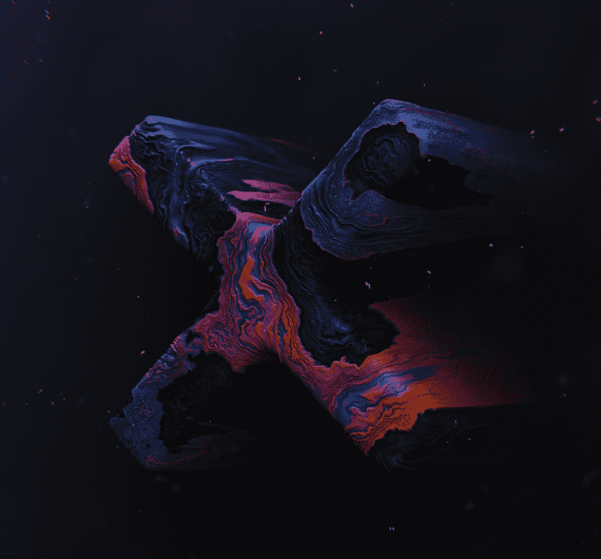

# [X] marks the spot

这一年是 2021 年。在这个确切的空间和时间点上发生了范式转变。 ✖ 标记该点。 该系列是对这场 NFT 革命运动的颂歌，也是对先驱者、创新者、远见者和信徒的致敬。 如同历史古迹，每一个✖都被锻造在区块链上，永远作为时空中这一刻的见证。 数字巨石与时代的振动相呼应。✖s 以 ERC-721 代币的形式存储在以太坊区块链上并托管在 IPFS 上。我的其他收藏：是什么让 Artistyonvisuals 游乐场

故事 
这个系列是 我迄今为止所有艺术努力的结晶；

十年的艺术表达和探索，成就了这一刻。

 

该系列非常个人化，但比我自己大得多；

这是关于所有正在处理心理健康问题的人。

这是我对这个项目最大的愿望，成为一辆车

这进行了讨论并减少了围绕心理健康 的污名。

 这些作品背后的过程涉及大量的内省和脆弱性。

我没有羞愧地把这些感情隐藏在我内心深处，而是决定把它们公开，

给他们一个表格，给他们起名字，和他们交朋友，甚至。通过这样做，我能够重新获得控制权。

解构和重塑。

 对我来说，每件作品都无缝循环非常重要，因为我描绘了所有这些挣扎

往往表现为重复循环。还特别注意命名这些作品。

负面情绪与正面形容词的并置可能暗示讽刺，

但这更多是关于我平衡事情的意图，作为围绕精神疾病的公开讨论

通常倾向于负面。

最终，这个系列提醒我们可以将挑战转化为机遇，

并奋斗成实力。我希望它能给你带来一种解脱和安慰的感觉

面对我们每天遇到的具有挑战性的经历。

