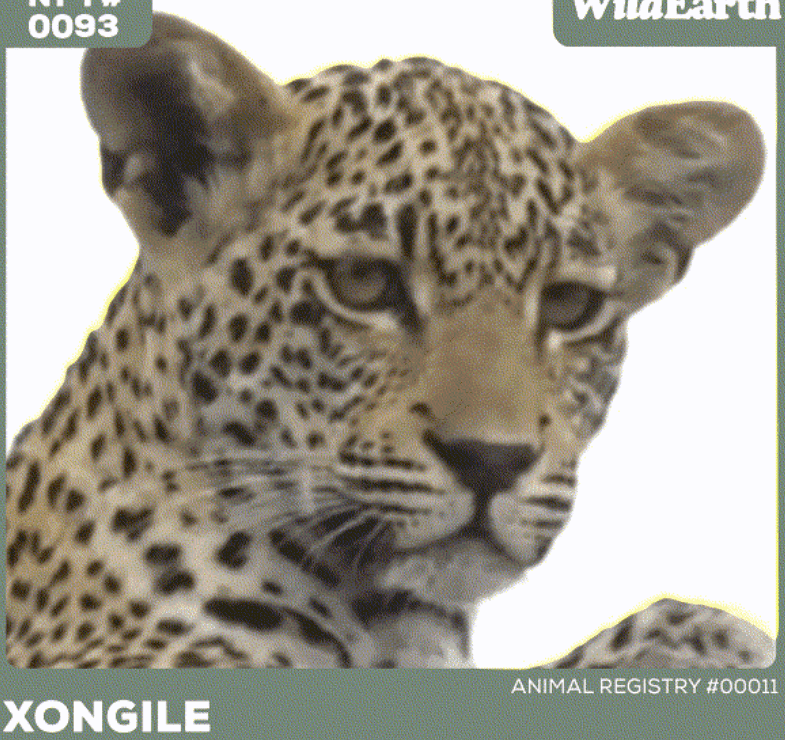

# Xongile WildEarth

Xongile 是 25 个 WildEarth Genesis Collections NFT 的一部分。 WildEarth 的野生动物保护 NFT 是同类产品中的第一个，因为它们直接有助于保护每只动物生活的栖息地。 原始薄荷的 40% 归属于 Xongile 的栖息地，每次转售的 8% 将永久归属于动物的栖息地。 借助 WildEarth 的野生动物保护 NFT，您将能够通过接收特殊更新和访问您的动物的目击记录与个体野生动物建立个人关系。

我们的野生动物保护不可替代代币 (NFT) 是同类中的第一个，因为它们直接有助于保护每只动物生活的栖息地。

野生动物保护就是保护野生动物栖息地，由于每次销售的一部分价值直接流向动物赖以生存的土地的保管人，这些 NFT 的买卖为他们提供持续的经济激励，以继续保护和保护动物。保护野生栖息地。

我们将在全球范围内发展我们的动物登记处，并通过为栖息地管理员提供新的收入来源，为野生动物保护做出永久贡献。

