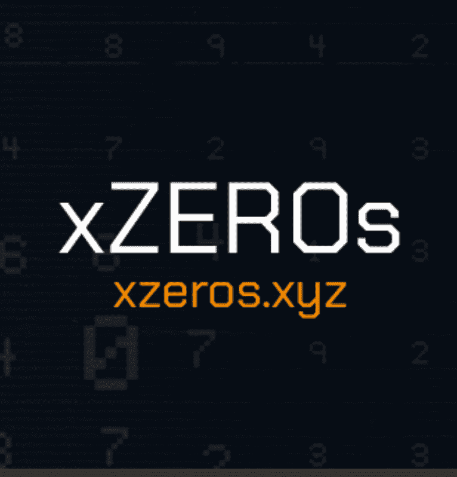

# xZEROs

过去 7 天没有售出 xZERO。

xZEROs 是 1001 个真正的跨链唯一生成的 NFT 的实验集合

**警告：** xZEROs 使用 LayerZero 协议来允许跨链铸造和移动 NFT。这是最早的 NFT 实现之一，并且是高度实验性的，并且可能在智能合约中包含错误或不可预见的问题。它仅用于实验目的。随意查看经过验证的源代码。

xZEROs NFT - 常见问题（FAQ）
▶ 什么是 xZERO？
xZEROs 是一个 NFT（不可替代代币）集合。存储在区块链上的数字艺术品集合。
▶ 有多少个 xZEROs 代币？
总共有 149 个 xZEROs NFT。目前 92 位所有者的钱包中至少有一个 xZEROs NTF。
▶ 最近卖出了多少 xZERO？
过去 30 天内售出了 0 个 xZEROs NFT。

