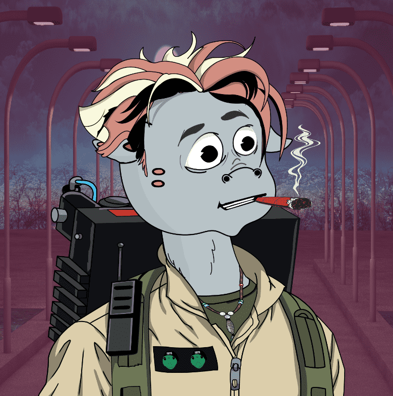

# Young Blood Turtles Society YBTS

这件艺术品是我自己 (Ahmed) 创作的，我是一名自学成才的数字艺术家。 我 11 岁的儿子启发我使用海龟作为这个系列的主角，因为他喜欢海龟，并且它在他成长过程中最喜欢的卡通电视节目中出现。我们希望您会喜欢我们共同创作的这件艺术品，这就是全部 手绘，非生成艺术。如有任何问题，请联系我们！

YBTS 是什么？
年轻血龟协会是 Polygon 区块链上随机生成的 6666 个独特 NFT 的集合。每只海龟都会附带一套特征，例如连身衣和太阳镜，再到帽子和翅膀！这些特征有不同的概率

