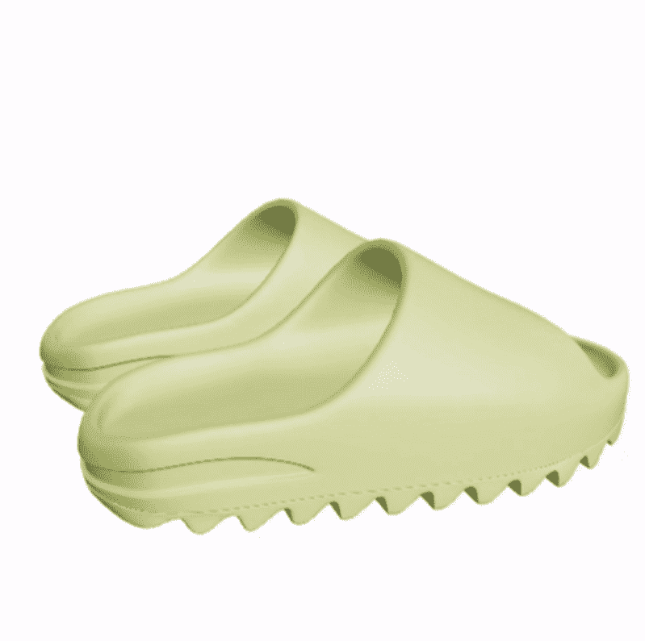

# YeezySlides NFT 3D Metaverse

每个钱包 2 个。 每个 .005 ETH。 我为您的 Ape 或 Metaverse 中的任何人创建了可穿戴的 Resin Colorway Yeezy Slides，一旦 SDK 解锁，FBX/OBJ 将包含在 Otherside 的兼容性空投中。 永远只发布 1,000 双。 我将通过元数据更新为未来版本提供更新。 当前 v0.0.2 krayverse.com

YeezySlides NFT 3D Metaverse NFT - 常见问题（FAQ）
▶ 什么是 YeezySlides NFT 3D 元界？
YeezySlides NFT 3D Metaverse 是一个 NFT（Non-fungible token）集合。存储在区块链上的数字艺术品集合。
▶ YeezySlides NFT 3D Metaverse 代币有多少？
总共有 880 个 YeezySlides NFT 3D Metaverse NFT。目前 560 位所有者的钱包中至少有一个 YeezySlides NFT 3D Metaverse NTF。
▶ 最近卖出了多少 YeezySlides NFT 3D Metaverse？
过去 30 天内售出了 0 个 YeezySlides NFT 3D Metaverse NFT。

