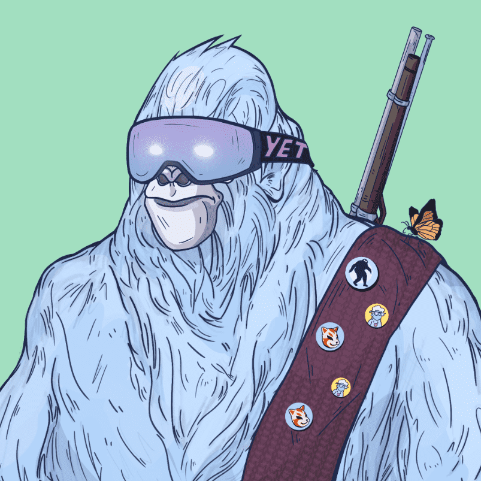

# YetiFam Genesis

很久以前，当地球上还没有人的时候，我们的世界已经被雪人居住了。 有八场比赛。 所以，他们住在北美。 如果你听说过人类是猴子的后代，那是错误的。 世界从雪人开始。 很快，你就会看到我们星球的历史是如何真正演变的。https://medium.com/@blacktigerback/yeti-fam-prehistory-a6300a9af152

来自 7000YetiFam Genesis 的进化。YetiLabz 的 Kintak 创世纪故事包含了 Yetiz 的艺术作品，他在使用 Vorpal Sword 和 Tesseract 制造了一种药水，在维加斯洞穴中折叠了空间并在地球上接种了鹅膏菌后，设计了地球上的生命。拥有该系列中的 Yeti 将在该项目中产生尽可能高的效用。

