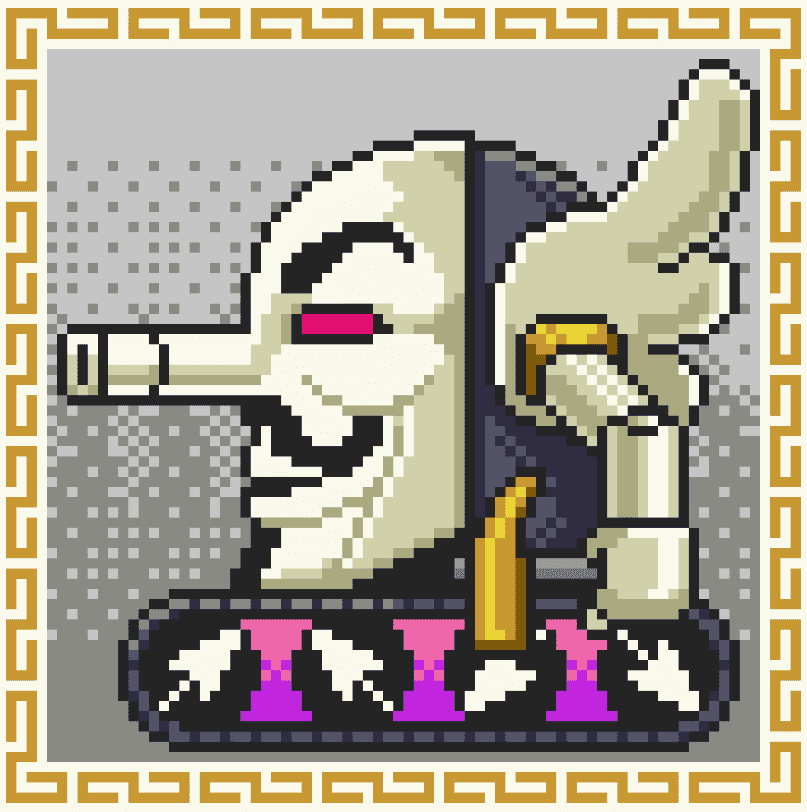

# YOKAIDO

ABOUT BUDDHA VERSEBUDDHAVERSE 是一个具有共同世界观的系列，由艺术家 Kazuki Takakura 的佛像和怪物刻画等多个 NFT 系列组成。每个 NFT 也是高仓的一件艺术品，将是角色的原稿。在这里出生的人物会从事各种类型的体育艺术和娱乐活动。同时，它也是一个研究和存档日本佛教和民间传说的艺术项目。 BUDDHAVERSE 是艺术家 Kazuki Takakura 的一个系列，具有共同的世界观，由多个 NFT 收藏组成，包括对佛像和幽灵的刻画。每个 NFT 也是 Takakura 的一件艺术品和一个角色的原创想法。同时也是一个研究和存档日本佛教和民间传说的艺术项目。

YOKAIDO NFT - 常见问题（FAQ）
▶ 什么是YOKAIDO？
YOKAIDO 是一个 NFT（Non-fungible token）集合。存储在区块链上的数字艺术品集合。
▶ 有多少 YOKAIDO 代币？
总共有 32 个 YOKAIDO NFT。目前 25 位所有者的钱包中至少有一个 YOKAIDO NTF。
▶ YOKAIDO 最贵的促销是什么？
最贵的 YOKAIDO NFT 是 018_MAKURAGAESHI。它于 2022-06-18（3 个月前）以 548.9 美元的价格售出。
▶最近卖了多少YOKAIDO？
过去 30 天内售出 1 个 YOKAIDO NFT。
▶ 什么是流行的 YOKAIDO 替代品？
许多拥有 YOKAIDO NFT 的用户还拥有 NFT-BUDDHA、 Voxel Robo Players、 Shiba inu Karuta和 Misorin。

